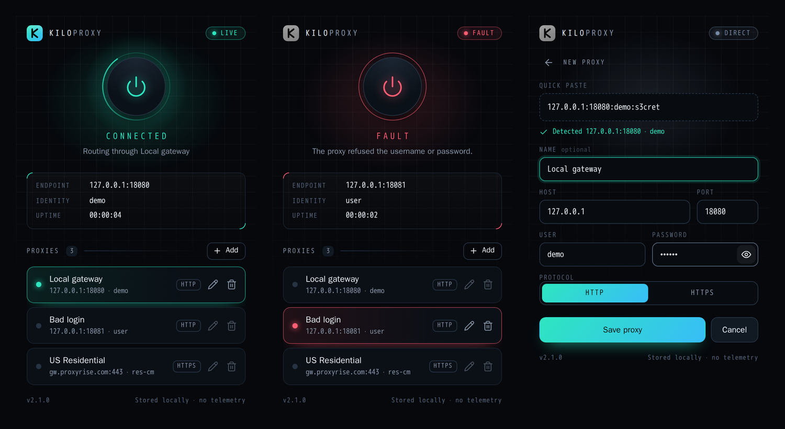

# KiloProxy

One-click proxy switcher for Chrome (Manifest V3). Save your proxies, tap one to connect, tap power to go direct. No server, no analytics. Everything stays in `chrome.storage.local`.



## Install

1. Open `chrome://extensions` and enable **Developer mode**.
2. **Load unpacked** and pick this folder.

## Use

- **Add:** hit **Add** and paste `host:port:user:pass` (also `user:pass@host:port`, `host:port`, IPv6, `http://…`). The fields fill themselves. Name it if you like, then save.
- **Connect:** tap a saved proxy. Tap the **power** button to go direct, or to reconnect the last one used.
- **Edit / delete:** the pencil and bin on each row. Delete asks for a second tap.
- **Status:** the toolbar icon lights up and shows `ON`, or `!` when something is wrong. The popup says what: a refused login, or another extension taking over your proxy settings.
- Closing the popup mid-edit loses nothing; the form is restored next time.

## How it works

- Proxy logins are answered by a synchronous, blocking `webRequest.onAuthRequired` listener. Async variants never answer proxy auth in MV3. Credentials are held in memory only and re-armed from storage whenever the worker starts.
- Switching profiles drops to direct for a moment first, so a new login on the same `host:port` re-authenticates instead of reusing the old login's sockets.
- On startup the worker checks Chrome's real proxy setting against the saved state and quietly re-applies it if Chrome dropped it (no direct gap).
- Only HTTP/HTTPS proxies are offered: Chrome can't answer authentication for SOCKS. Local addresses bypass the proxy.

## Layout

```
manifest.json
icons/                  logo.svg + on/off toolbar PNGs
src/
  background/           index (controller) · auth · proxy · toolbar
  popup/                index.html · styles.css · main · home · editor · status · dom
  shared/               parse · profile · store · messages
test/                   unit tests (node:test)
tools/                  e2e harness (real Chromium + 407 proxy) · icon generator
tasklist.md             status, gotchas and next steps for the next session
```

## Develop

```sh
npm test                      # unit tests, no dependencies
node tools/e2e/flow.mjs       # full UI + auth + restart run; needs playwright-core + Chromium
npm i --no-save sharp && node tools/make-icons.mjs   # regenerate icons/
```

See `tasklist.md` for the e2e environment variables and the gotchas worth knowing before changing anything.
